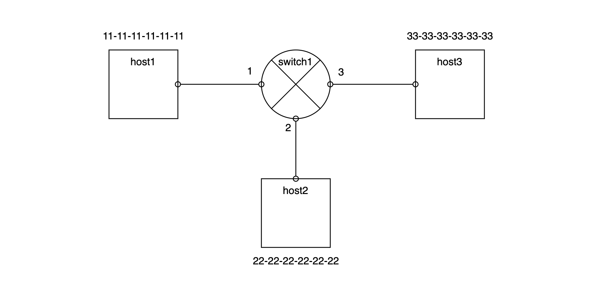

# Integration Test Scenario

## Network Type

### Type-1

Type-1 network is very simple. There's two host on the network each has hardware address "11-11-11-11-11-11", "11-11-11-11-11-12" respectively. And those are connected on single link with port

### Type-2

Type-2 network has one switch "switch1" and three host ("host1", "host2", "host3"). Those three hosts are connected with link on the switch.

### Type-3

Type-3 network has two switches ("switch1", "switch2") and three hosts ("host1", "host2", "host3"). On "switch1", there's three ports and each connected with "host1", "host2", "switch2". And on "switch2", there's two ports and each connected with "switch1" and "host3"

## Link Layer

### Scenario-1: simple frame transmission between two nodes without switch

#### Network Type

- Type-1

#### Description

- "host1" sends frame which contains "hello" payload to "host2"
- "host2" verify "hello" frame payload

### Sceanrio-2: broadcast frame by switch

#### Network Type

- Type-2

#### Description

- The purpose of sceanrio-2 is to veryify when switch has no forward data on table, it broadcasts frame to ports it has
- "switch1" has forwarding table but it is empty. 
- "host1" tries to send frame to "host2"
- when "switch1" receives frame from "host1", first update forwarding table then "switch1" broadcasts frame to other ports except port which is attached to "host1"
- "host2", "host3" have to receive frame sent by "host1"

### Sceanrio-3: unicast frame by switch if forward-table entry exists for target node

#### Network Type

- Type-2

#### Description

- The purpose of sceanrio-3 is to veryify when switch has forward data on table, it unicasts frame to target host
- "switch1" has forwarding table and has information where "host2" exists
- "host1" tries to send frame to "host2"
- "host2" have to receive frame sent by "host1" and "host3" should not

### Sceanrio-4: discard frame when target exists on same port where it receives frame

#### Network Type

- Type-3

#### Description

- The purpose of sceanrio-3 is to veryify when switch receives frame from the port and switch forwarding table says target host exists on the same port where the frame comes from, then switch discard that frame.
- "switch1" has forwarding table with empty state
- "switch2" has forwarding table and has information about "host2" exists on port "1".
- "host1" tries to send frame to "host2"
- when "switch1" receives frame from "host1" it broadcasts to other ports.
- when "switch2" receives frame from "switch1", because it has information target host ("host2") exists on the port where it attached to "switch1", it discards frame
- "host2" have to receive frame sent by "host1" and "host3" should not

## ARP

TBD
